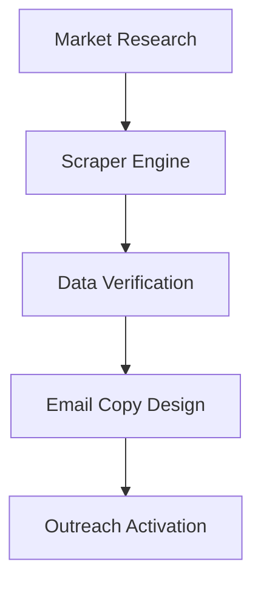

# Business Overview & Growth Strategy: PTN Relay Solutions

> **PTN Relay Solutions** operates as the autonomous B2B growth and lead generation engine for **PLUGTHENATION LTD (PTN)**. It represents a state-of-the-art cold outreach infrastructure combining custom web scraping, data validation, and AI-driven sequence generation.

---

## 1. Objective & Value Proposition
* **Objective:** Establish a highly automated B2B client acquisition pipeline for PTN's Systems & Automation services.
* **Core Product:** **Relay Solutions** — a private, locally-hosted platform that empowers companies to conduct hyper-personalized outreach.
* **Core Value:** Automating tedious, manual outbound marketing by employing cooperative AI agents that scrape leads, validate deliverability, draft contextual B2B emails, and schedule delivery loops.

---

## 2. Operations & Execution Strategy

### 2.1 Lead Scraping & Enrichment
* Utilize the custom Puppeteer scraper to extract businesses in high-value, underserved sectors.
* Enrich lead records with specific operational insights (e.g., whether they lack automated booking, miss phone calls, or have manual quoting processes).

### 2.2 Data Quality & GDPR Compliance
* Maintain a strict **99%+ deliverability standard** by validating all email addresses.
* Filter out all personal domains (Gmail, Yahoo, Hotmail, etc.) to comply with B2B legitimate interest requirements.
* Deduplicate prospects globally across all campaigns to preserve brand reputation.

### 2.3 Conversational Copywriting
* Emails are generated to match the brand voice: professional, brief, direct, and peer-to-peer.
* Enforce strict constraints:
  * No marketing buzzwords.
  * Word limits: Hook (< 60 words), Nudge (< 100 words).
  * No bullet points or pushy sales pitches.
  * Simple, clear footers with a functional unsubscribe mechanism.

---

## 3. Operational Infrastructure

### 3.1 Cooperative Agent Framework
The RELAY department operates with five dedicated AI roles:
1. **The Boss (CEO)**: Sets campaign goals, capacity limits, and targets.
2. **Manager (Operations Orchestrator)**: Monitors campaign performance and pipeline bottlenecks.
3. **Market Researcher**: Identifies high-value industries and top metropolitan targets.
4. **Sales Strategist**: Architect of email copy, target pain points, and sequence structure.
5. **Emailer**: Manages JIT personalization, sender accounts, and campaign schedules.

### 3.2 Platform URLs
* **Backend API:** `http://localhost:3001`
* **Frontend Portal:** `http://localhost:5174`
