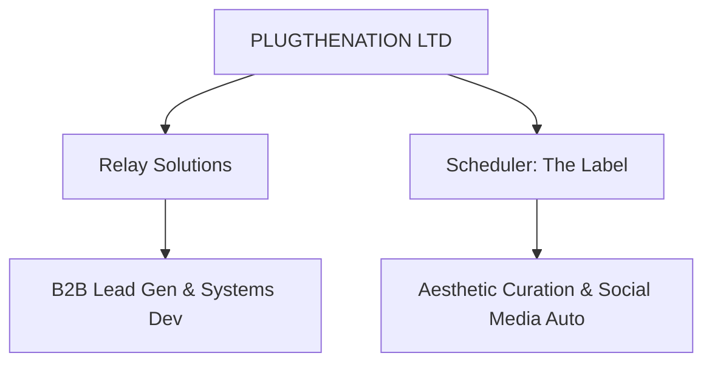

# PLUGTHENATION LTD (PTN) — Conglomerate Structural Map

> **Company Outline & Operational Directives**
> PTN is the parent corporation overseeing a portfolio of specialized sub-companies, directing automated operations, system development, and high-volume media curation.

---

## 1. Corporate Architecture

PTN acts as the central hub for innovation, system development, and workflow automation. It operates two primary sub-companies:

---

## 2. Sub-Companies

### 2.1 Relay Solutions
* **Focus:** B2B Freelance Automation, Systems Development, and Lead Generation.
* **Core Systems:**
  * **Private Lead Scraper**: A Puppeteer-based crawler designed to harvest leads from directories and search results.
  * **Lead Validator**: An email verification service verifying MX records and domain deliverability.
  * **Email Orchestrator**: An Express-based mail daemon utilizing pg_cron to schedule and deploy automated B2B outreach campaigns.
* **Operational Directive**: Deploy autonomous AI agents to research markets, scrape leads, and generate personalized, high-conversion email sequences to secure development contracts.

### 2.2 Scheduler (The Label)
* **Focus:** Automated Curation, Video Generation, and High-Volume Media Distribution.
* **Core Systems:**
  * **Pinterest Curation Engine**: A system that scrapes and downloads images based on dark aesthetic color themes (Pink, Red, Green).
  * **Asset Processor**: A service sorting images into organized folders.
  * **Slideshow Generator**: A utility that stitches images together into promotional video slideshows for music releases (currently promoting Mani Rae's "What It Feels Like ft. Bigz / Breezy").
  * **Postiz API Integration**: An automated publishing scheduler posting to multiple social media channels (e.g. TikTok, Pinterest, Instagram) every 4 hours.
* **Operational Directive**: Drive massive, passive organic traffic for music releases without human intervention.

---

## 3. Technology & Automation Standards

Across all subsidiaries, PTN mandates the following operational principles:
1. **Autonomous Agency**: Operations must run via cooperating AI agent networks to eliminate manual bottlenecks.
2. **Quality Control**: All outbound communication (email or social media) must adhere to rigorous quality guidelines, strict length and tone rules, and GDPR constraints.
3. **Data Integrity**: Global deduplication and strict validation check steps must run before any outreach or post publishing.
