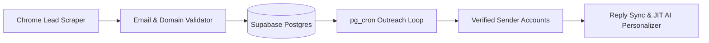

# RELAY Solutions — Cold Outreach & B2B Lead Management Platform

> **Legitimate Interest & Automated Growth Engine**
> Relay Solutions is a private, locally-hosted platform designed to scrape B2B prospects, validate email deliverability, and execute hyper-personalized cold email outreach campaigns.

---

## 1. System Overview

Relay runs on a dual-service architecture:
1. **Frontend (Vite + React)**: A modern, borderless dashboard to manage campaigns, monitor replies, inspect lead lists, and track sending progress.
2. **Backend (Node.js + Express + Supabase)**: The core engine that processes REST API commands, manages chromium-based lead scrapers, and interfaces with Supabase to queue outreach steps.



---

## 2. The Campaign Lifecycle (Step-by-Step)

The Relay platform automates the outbound pipeline in four distinct phases:

### Phase 1: Target Research & Lead Scraping
* The platform utilizes a puppeteer-based Google Maps and directory scraper to extract local business names, addresses, websites, phone numbers, and emails.
* **USA Metro Targeting**: Default focus is on the top 50 US metropolitan hubs to ensure lead density.
* **UK/Regional Targeting**: Targeted regions are defined by specific company briefs (e.g. London & the Midlands for MrMedic).

### Phase 2: Data Validation & Deduplication
* Scraped leads are processed by the validator to check:
  * Email syntax correctness.
  * Domain MX records and parked domain statuses.
  * **GDPR Verification**: Automatic exclusion of personal email providers (`@gmail.com`, `@hotmail.com`, `@yahoo.com`, `@outlook.com`) to enforce B2B legitimate interest compliance.
  * Global deduplication to prevent contacting the same business across different campaigns.

### Phase 3: Email Sequence Design
* Campaigns are limited to a maximum of **5 sequence templates** to prevent spamming and maintain a focused, high-conversion thread.
* Subject lines are engineered to be sentence-case, personalized, and under 9 words, avoiding clickbait patterns.
* The system enforces a strict word count limit:
  * **Email 1 (Hook)**: Under 60 words.
  * **Email 2 (Nudge)**: Under 100 words.
  * **Email 3 (Close)**: Under 110 words.

### Phase 4: Active Scheduling & pg_cron Sending
* The email delivery engine is activated via `ACTIVATE_SCHEDULE`.
* High-reputation sender accounts are associated with the campaign, capping outbound email volume at 50 messages/day per domain.
* The system automatically syncs replies and halts the outreach loop for any prospect that responds.

---

## 3. Configuration & Deployment

### Environment Settings (`.env`)
Ensure the backend has the following variables configured:
```ini
SUPABASE_URL=https://your-project.supabase.co
SUPABASE_ANON_KEY=eyJhbGciOi...
SUPABASE_SERVICE_ROLE_KEY=eyJhbGciOi...
DEEPSEEK_API_KEY=sk-...
SMTP_HOST=mail.yourdomain.com
SMTP_PORT=465
```

### Deployment Architecture
* **Frontend**: Deployed to **Vercel** with the `VITE_API_URL` environment variable mapped to the live API host.
* **Backend**: Hosted on a persistent cPanel Node.js application running 24/7 with `server/index.mjs` as the application startup file.
